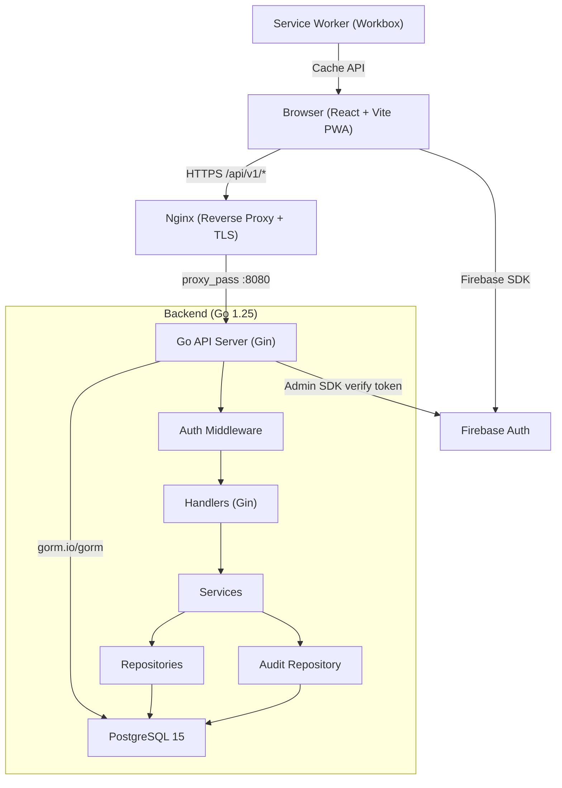
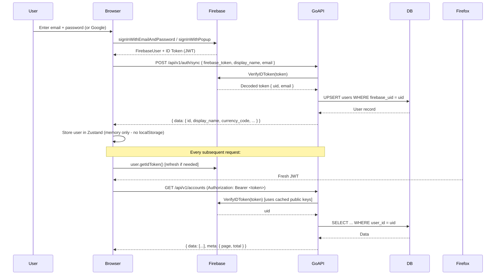
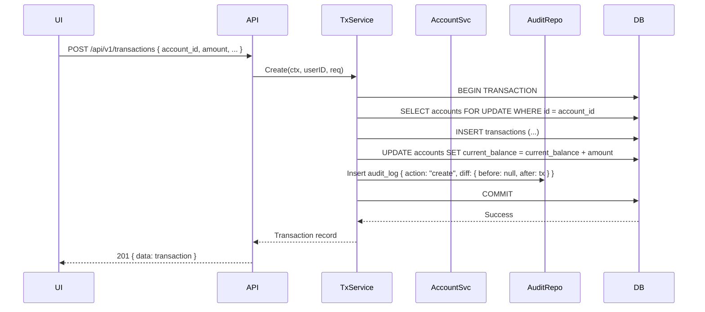

# ARCHITECTURE.md — ledgerA System Design

## Table of Contents

1. [Pre-Build Review](#pre-build-review)
2. [System Overview Diagram](#system-overview-diagram)
3. [Layer Architecture](#layer-architecture)
4. [Auth Flow](#auth-flow)
5. [Data Flow](#data-flow)
6. [ADR Index](#adr-index)

---

## Pre-Build Review

All [DA] and [ToT] blocks were evaluated before implementation. All verdicts are PROCEED or REVISED — no unresolved challenges.

### [DA: Auth Strategy]

```
Decision:   Verify Firebase JWTs server-side on every protected request.
Challenge:  Per-request verification adds latency and requires external network calls.
Evidence:   Firebase Admin SDK caches Google's public JWKS locally and verifies
            signatures cryptographically — no external call per request after warm-up.
Rebuttal:   Verification is a local crypto operation (~0.1ms). No meaningful latency.
            Server-side verification is non-negotiable for security: client-side only
            would allow token forgery.
Verdict:    PROCEED
```

### [DA: Balance Maintenance Strategy]

```
Decision:   Application-level balance maintenance using DB transactions + SELECT FOR UPDATE.
Challenge:  Concurrent transactions for the same account can cause race conditions,
            resulting in corrupted current_balance values.
Evidence:   Two concurrent POST /transactions requests can both read the same balance,
            add their amounts independently, and write back to the same row — classic
            lost-update anomaly.
Rebuttal:   Using `db.Transaction()` with `SELECT ... FOR UPDATE` locks the account row
            for the duration of the transaction. Only one write proceeds at a time.
            This is serializable for single-account operations.
Verdict:    REVISED — App logic with explicit pessimistic row locking (not DB trigger).
            See ADR-001.
```

### [DA: PDF Library Choice]

```
Decision:   Use github.com/go-pdf/fpdf (maintained fork of gofpdf).
Challenge:  jung-kurt/gofpdf is widely known and has more Stack Overflow coverage.
Evidence:   jung-kurt/gofpdf is archived (read-only) as of 2021. No bug fixes or
            Go version compatibility updates will be made upstream.
Rebuttal:   go-pdf/fpdf is the officially endorsed active fork, identical API, receives
            ongoing maintenance. Architecture decision is straightforward.
Verdict:    PROCEED with go-pdf/fpdf.
```

### [DA: Frontend State Management]

```
Decision:   TanStack Query v5 for server state + Zustand for UI state.
Challenge:  Two state libraries add complexity. React Context API could replace both.
Evidence:   Context API re-renders all consumers on any state change. For server state
            (transactions list, accounts), this causes cascade re-renders across the
            entire tree. Context has no built-in cache invalidation, deduplication,
            or background refetch.
Rebuttal:   TanStack Query provides: automatic caching, deduplication, stale-while-
            revalidate, optimistic updates, and background refetch. Zustand provides
            selective subscriptions (only subscribed component re-renders). Combined,
            they are ~12KB gzipped and replace hundreds of lines of Context boilerplate.
Verdict:    PROCEED.
```

### [DA: PWA Offline Strategy]

```
Decision:   NetworkFirst for /api/*, CacheFirst for /assets/*, offline banner for UX.
Challenge:  POST/PATCH/DELETE mutations will silently fail while offline.
Evidence:   Workbox BackgroundSync can queue failed mutations and retry when online.
Rebuttal:   BackgroundSync requires IndexedDB queue management and complex conflict
            resolution (server may reject stale mutations). For v1, we show an offline
            banner and disable write actions. Data is always fresh on reconnect.
            BackgroundSync can be added as a v2 enhancement.
Verdict:    PROCEED — read-only offline mode with clear UX indicator.
```

### [DA: Folder Structure]

```
Decision:   Standard golang-standards/project-layout with internal/, cmd/, pkg/.
Challenge:  All Go code in a flat structure is simpler for small projects.
Evidence:   Go's `internal/` package prevents external imports, enforcing boundaries.
            Flat structure collapses service/repository/handler into one package,
            making dependency injection and testing harder.
Rebuttal:   The layered structure pays dividends immediately: handlers can be tested
            by injecting mock services; services by injecting mock repositories.
Verdict:    PROCEED.
```

### [ToT: current_balance Storage Strategy]

```
[ToT: current_balance-storage]
Branch A: DB Trigger
  Approach:  PostgreSQL trigger on INSERT/UPDATE/DELETE on transactions table
             automatically updates accounts.current_balance.
  Consequence: Balance always consistent. Logic hidden in DB; harder to test in Go.
               Migrations must manage trigger lifecycle.
  Score: 7/10

Branch B: Computed View / Query
  Approach:  No stored balance. Every read SELECTs SUM(amount) from transactions.
  Consequence: Always correct. No sync issues. Slow for accounts with many transactions.
               Cannot efficiently show balance without a full table scan per account.
  Score: 5/10

Branch C: Application Logic with Pessimistic Lock
  Approach:  Service layer updates current_balance inside db.Transaction() with
             SELECT FOR UPDATE on the account row.
  Consequence: Balance maintained consistently. Fully testable in Go unit tests.
               Slightly more application code. Handles concurrent writes correctly.
  Score: 9/10

Chosen: Branch C — Application logic with explicit row locking.
Reason: Best combination of correctness, testability, and performance.
See: docs/adr/ADR-001-balance-maintenance.md
```

### [ToT: Running Balance Display in Passbook]

```
[ToT: running-balance-passbook]
Branch A: Window function in SQL (SUM OVER PARTITION BY ORDER BY)
  Consequence: DB computes cumulative sum in a single query. Perfectly accurate.
               Requires sorting by transaction_date + created_at.
  Score: 9/10

Branch B: Frontend calculation
  Consequence: Simple. Breaks with pagination — balance resets on each page.
  Score: 3/10

Branch C: Pre-computed field in transactions table
  Consequence: Consistent reads. Complex to maintain on inserts/updates/deletes.
  Score: 6/10

Chosen: Branch A — SQL window function.
Implementation: Passbook endpoint returns transactions with running_balance field
computed as: opening_balance + SUM(amount) OVER (ORDER BY transaction_date, created_at).
```

---

## System Overview Diagram



---

## Layer Architecture

```
┌────────────────────────────────────────────────────────┐
│                   HTTP Request                         │
└───────────────────────┬────────────────────────────────┘
                        ↓
┌────────────────────────────────────────────────────────┐
│       Middleware Layer  (internal/middleware/)          │
│  LoggerMiddleware → RecoveryMiddleware → AuthMiddleware │
└───────────────────────┬────────────────────────────────┘
                        ↓
┌────────────────────────────────────────────────────────┐
│         Handler Layer  (internal/handler/)             │
│  Parse HTTP → Validate DTO → Call Service → Respond   │
│  No business logic. No direct DB access.               │
└───────────────────────┬────────────────────────────────┘
                        ↓
┌────────────────────────────────────────────────────────┐
│          Service Layer  (internal/service/)            │
│  All business logic. Uses Repository interfaces.       │
│  Writes to audit_log on every mutation.                │
└───────────────────────┬────────────────────────────────┘
                        ↓
┌────────────────────────────────────────────────────────┐
│       Repository Layer  (internal/repository/)         │
│  GORM queries only. No business logic.                 │
│  Accepts context.Context as first argument.            │
└───────────────────────┬────────────────────────────────┘
                        ↓
┌────────────────────────────────────────────────────────┐
│             PostgreSQL 15  (via GORM)                  │
└────────────────────────────────────────────────────────┘
```

Dependency direction: outer layers depend on inner layers via interfaces.
No inner layer imports an outer layer.

---

## Auth Flow



---

## Data Flow

### Transaction Creation



---

## ADR Index

| ADR | Title | Status | Date |
|-----|-------|--------|------|
| [ADR-001](adr/ADR-001-balance-maintenance.md) | Account Balance Maintenance Strategy | Accepted | 2026-03-15 |

Additional ADRs will be created for each major ToT decision:
- ADR-002: PDF Library Choice (go-pdf/fpdf)
- ADR-003: Frontend State Management (TanStack Query + Zustand)
- ADR-004: PWA Offline Strategy

See `docs/adr/` directory for full ADR documents.
